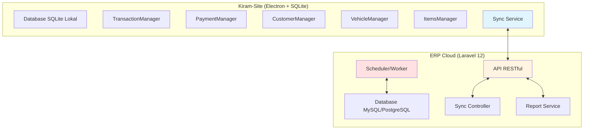
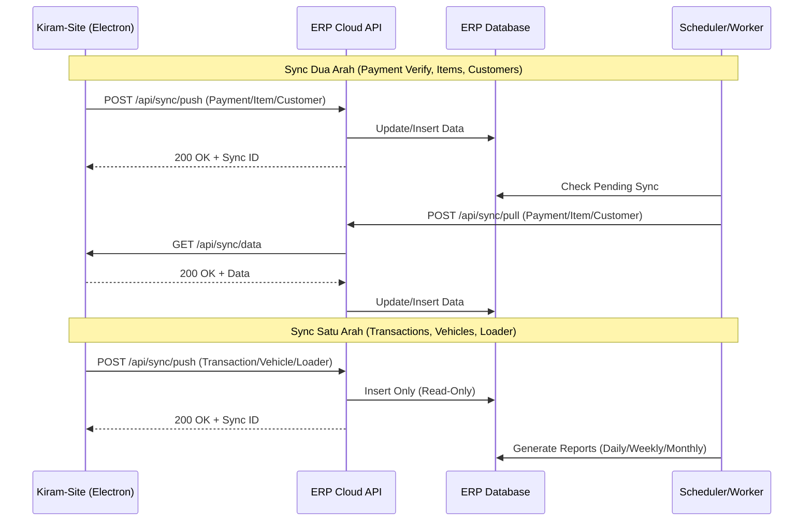

# Rencana Implementasi Sync ERP Cloud dengan Kiram-Site

## Ringkasan

Dokumen ini merencanakan implementasi sistem sinkronisasi (sync) antara aplikasi **kiram-site** (Electron + SQLite) dan **ERP Cloud** (Laravel 12). Sistem ini akan mengelola data Customers, Vehicles, Items, Transactions, Transaction Items, dan Payments dengan kebutuhan sync dua arah dan satu arah.

---

## 1. Arsitektur Sistem

### 1.1 Komponen Utama



### 1.2 Alur Data Sync



---

## 2. Klasifikasi Data Sync

### 2.1 Sync Dua Arah (Bidirectional)

| Data Entity              | Arah | Keterangan                                                     |
| ------------------------ | ---- | -------------------------------------------------------------- |
| **Payment Verification** | ↔    | Status verifikasi pembayaran bisa diverifikasi dari kedua sisi |
| **Customers**            | ↔    | Data master customer bisa diupdate dari kedua sisi             |

### 2.2 Sync Satu Arah (Unidirectional)

| Data Entity              | Arah | Keterangan                                         |
| ------------------------ | ---- | -------------------------------------------------- |
| **Transactions**         | →    | Hanya push dari Electron ke ERP (read-only di ERP) |
| **Transaction Items**    | →    | Hanya push dari Electron ke ERP (read-only di ERP) |
| **Transaction Vehicles** | →    | Hanya push dari Electron ke ERP (read-only di ERP) |
| **Transaction Payments** | →    | Hanya push dari Electron ke ERP (read-only di ERP) |
| **Loader Queue**         | →    | Hanya push dari Electron ke ERP (read-only di ERP) |

### 2.3 Catatan Penting: Tabel yang Sudah Ada di ERP Cloud

**Tabel-tabel berikut sudah ada di ERP Cloud untuk fitur yang berbeda dan TIDAK digunakan untuk transaksi jual beli:**

| Tabel ERP Cloud | Fitur yang Digunakan                  | Solusi untuk Transaksi Jual Beli              |
| --------------- | ------------------------------------- | --------------------------------------------- |
| **items**       | Asset Management                      | Buat tabel khusus: **`transaction_items`**    |
| **payments**    | Procurement (On Progress Development) | Buat tabel khusus: **`transaction_payments`** |
| **vehicles**    | Asset Management                      | Buat tabel khusus: **`transaction_vehicles`** |

**Implikasi:**

- Data transaksi jual beli dari kiram-site akan disimpan di tabel khusus dengan prefix `transaction_*`
- Tabel-tabel khusus transaksi hanya untuk **monitoring dan reporting**
- Sync untuk semua data transaksi adalah **satu arah** (Electron → ERP)
- **Payment Verification** tetap sync dua arah karena membutuhkan proses approval dari ERP Cloud

---

## 3. Database Schema ERP Cloud

### 3.1 Migrations untuk Sync System

```php
// database/migrations/xxxx_xx_xx_create_sync_logs_table.php

public function up()
{
    Schema::create('sync_logs', function (Blueprint $table) {
        $table->id();
        $table->string('sync_id')->unique();
        $table->string('entity_type'); // payment, item, customer, transaction, vehicle, loader
        $table->unsignedBigInteger('entity_id');
        $table->string('sync_direction'); // push, pull
        $table->string('sync_status'); // pending, completed, failed
        $table->json('payload');
        $table->text('error_message')->nullable();
        $table->timestamp('synced_at')->nullable();
        $table->timestamps();

        $table->index(['entity_type', 'entity_id']);
        $table->index('sync_id');
        $table->index('sync_status');
    });
}
```

### 3.2 Core Tables (Mapping dari Kiram-Site)

#### 3.2.1 Customers Table

```php
// database/migrations/xxxx_xx_xx_create_customers_table.php

public function up()
{
    Schema::create('customers', function (Blueprint $table) {
        $table->id();
        $table->string('code')->unique();
        $table->string('name');
        $table->enum('category', ['PERSONAL', 'COMPANY']);
        $table->boolean('is_active')->default(true);
        $table->timestamp('synced_at')->nullable();
        $table->timestamps();
        $table->softDeletes();

        $table->index('code');
        $table->index('is_active');
    });
}
```

#### 3.2.2 Transaction Vehicles Table (Khusus untuk Transaksi Jual Beli)

**Catatan**: Tabel ini khusus untuk menyimpan data kendaraan yang terlibat dalam transaksi jual beli. Tabel `vehicles` yang sudah ada di ERP Cloud digunakan untuk Asset Management.

```php
// database/migrations/xxxx_xx_xx_create_transaction_vehicles_table.php

public function up()
{
    Schema::create('transaction_vehicles', function (Blueprint $table) {
        $table->id();
        $table->foreignId('transaction_id')->constrained()->onDelete('cascade');
        $table->string('plate_number');
        $table->foreignId('customer_id')->nullable()->constrained()->onDelete('set null');
        $table->string('customer_name')->nullable();
        $table->string('customer_category')->nullable();
        $table->boolean('is_active')->default(true);
        $table->timestamp('synced_at')->nullable();
        $table->timestamps();

        $table->index('transaction_id');
        $table->index('plate_number');
        $table->index('customer_id');
    });
}
```

#### 3.2.3 Transaction Items Table

**Catatan**: Tabel ini khusus untuk menyimpan item-item yang terlibat dalam transaksi jual beli. Tabel `items` yang sudah ada di ERP Cloud digunakan untuk Asset Management.

```php
// database/migrations/xxxx_xx_xx_create_transaction_items_table.php

public function up()
{
    Schema::create('transaction_items', function (Blueprint $table) {
        $table->id();
        $table->foreignId('transaction_id')->constrained()->onDelete('cascade');
        $table->string('item_name');
        $table->string('item_unit');
        $table->decimal('item_price', 15, 2);
        $table->integer('qty');
        $table->decimal('subtotal', 15, 2);
        $table->timestamp('synced_at')->nullable();
        $table->timestamps();

        $table->index('transaction_id');
    });
}
```

#### 3.2.4 Transaction Payments Table

**Catatan**: Tabel ini khusus untuk menyimpan pembayaran yang terlibat dalam transaksi jual beli. Tabel `payments` yang sudah ada di ERP Cloud digunakan untuk Procurement.

```php
// database/migrations/xxxx_xx_xx_create_transaction_payments_table.php

public function up()
{
    Schema::create('transaction_payments', function (Blueprint $table) {
        $table->id();
        $table->foreignId('transaction_id')->constrained()->onDelete('cascade');
        $table->string('payment_method_name');
        $table->decimal('amount', 15, 2);
        $table->enum('status', ['PENDING', 'PAID']);
        $table->enum('verification_status', ['PENDING', 'VERIFIED', 'REJECTED']);
        $table->timestamp('paid_at');
        $table->foreignId('verified_by')->nullable()->constrained()->onDelete('set null');
        $table->text('rejection_reason')->nullable();
        $table->text('notes')->nullable();
        $table->string('proof_image_path')->nullable();
        $table->string('proof_file_hash')->nullable();
        $table->string('proof_mime_type')->nullable();
        $table->text('proof_thumbnail')->nullable();
        $table->decimal('proof_file_size', 10, 2)->nullable();
        $table->timestamp('proof_uploaded_at')->nullable();
        $table->timestamp('proof_last_verified')->nullable();
        $table->timestamp('synced_at')->nullable();
        $table->timestamps();

        $table->index('transaction_id');
        $table->index('verification_status');
        $table->index('paid_at');
    });
}
```

#### 3.2.5 Transactions Table

```php
// database/migrations/xxxx_xx_xx_create_transactions_table.php

public function up()
{
    Schema::create('transactions', function (Blueprint $table) {
        $table->id();
        $table->string('invoice_number')->unique();
        $table->foreignId('transaction_type_id')->constrained()->onDelete('restrict');
        $table->foreignId('customer_id')->constrained()->onDelete('restrict');
        // Note: vehicle_id dihapus karena menggunakan transaction_vehicles
        $table->decimal('total_amount', 15, 2);
        $table->enum('payment_status', ['UNPAID', 'PAID']);
        $table->enum('transaction_status', ['CREATED', 'QUEUED', 'LOADING', 'DONE', 'CHECKED_OUT']);
        $table->foreignId('created_by')->constrained()->onDelete('restrict');
        $table->text('notes')->nullable();
        $table->timestamp('synced_at')->nullable();
        $table->timestamps();

        $table->index('invoice_number');
        $table->index('customer_id');
        $table->index('vehicle_id');
        $table->index('payment_status');
        $table->index('transaction_status');
        $table->index('created_at');
    });
}
```

#### 3.2.6 Transaction Items Table

```php
// database/migrations/xxxx_xx_xx_create_transaction_items_table.php

public function up()
{
    Schema::create('transaction_items', function (Blueprint $table) {
        $table->id();
        $table->foreignId('transaction_id')->constrained()->onDelete('cascade');
        $table->foreignId('item_id')->constrained()->onDelete('restrict');
        $table->integer('qty');
        $table->decimal('price', 15, 2);
        $table->decimal('subtotal', 15, 2);
        $table->timestamp('synced_at')->nullable();
        $table->timestamps();

        $table->index('transaction_id');
        $table->index('item_id');
    });
}
```

#### 3.2.7 Payments Table

```php
// database/migrations/xxxx_xx_xx_create_payments_table.php

public function up()
{
    Schema::create('payments', function (Blueprint $table) {
        $table->id();
        $table->foreignId('transaction_id')->constrained()->onDelete('cascade');
        $table->foreignId('payment_method_id')->constrained()->onDelete('restrict');
        $table->decimal('amount', 15, 2);
        $table->enum('status', ['PENDING', 'PAID']);
        $table->enum('verification_status', ['PENDING', 'VERIFIED', 'REJECTED']);
        $table->timestamp('paid_at');
        $table->foreignId('verified_by')->nullable()->constrained()->onDelete('set null');
        $table->text('rejection_reason')->nullable();
        $table->text('notes')->nullable();
        $table->string('proof_image_path')->nullable();
        $table->string('proof_file_hash')->nullable();
        $table->string('proof_mime_type')->nullable();
        $table->text('proof_thumbnail')->nullable();
        $table->decimal('proof_file_size', 10, 2)->nullable();
        $table->timestamp('proof_uploaded_at')->nullable();
        $table->timestamp('proof_last_verified')->nullable();
        $table->timestamp('synced_at')->nullable();
        $table->timestamps();

        $table->index('transaction_id');
        $table->index('verification_status');
        $table->index('paid_at');
    });
}
```

#### 3.2.8 Loader Queue Table

```php
// database/migrations/xxxx_xx_xx_create_loader_queue_table.php

public function up()
{
    Schema::create('loader_queue', function (Blueprint $table) {
        $table->id();
        $table->string('task_id')->unique(); // e.g., LOAD-001
        $table->foreignId('transaction_id')->constrained()->onDelete('cascade');
        $table->string('vehicle_plate_number'); // Menggunakan plate_number bukan vehicle_id
        $table->enum('status', ['queued', 'in_progress', 'completed', 'cancelled']);
        $table->enum('priority', ['normal', 'high', 'urgent'])->default('normal');
        $table->timestamp('scheduled_at');
        $table->timestamp('started_at')->nullable();
        $table->timestamp('completed_at')->nullable();
        $table->foreignId('started_by')->nullable()->constrained()->onDelete('set null');
        $table->foreignId('completed_by')->nullable()->constrained()->onDelete('set null');
        $table->text('notes')->nullable();
        $table->timestamp('synced_at')->nullable();
        $table->timestamps();

        $table->index('task_id');
        $table->index('transaction_id');
        $table->index('status');
        $table->index('scheduled_at');
    });
}
```

#### 3.2.9 Transaction Status Logs Table

```php
// database/migrations/xxxx_xx_xx_create_transaction_status_logs_table.php

public function up()
{
    Schema::create('transaction_status_logs', function (Blueprint $table) {
        $table->id();
        $table->foreignId('transaction_id')->constrained()->onDelete('cascade');
        $table->enum('status', ['CREATED', 'QUEUED', 'LOADING', 'DONE', 'CHECKED_OUT']);
        $table->foreignId('changed_by')->constrained()->onDelete('restrict');
        $table->text('note')->nullable();
        $table->timestamp('synced_at')->nullable();
        $table->timestamps();

        $table->index('transaction_id');
        $table->index('changed_by');
        $table->index('changed_at');
    });
}
```

---

## 4. API Endpoints Design

### 4.1 Authentication Endpoints (Sudah ada di laravel-auth-api-plan.md)

```
POST   /api/auth/login
POST   /api/auth/refresh
GET    /api/auth/me
POST   /api/auth/logout
```

### 4.2 Sync Endpoints

```
# Push Data dari Electron ke ERP
POST   /api/sync/push
POST   /api/sync/push/batch
GET    /api/sync/status/{sync_id}

# Pull Data dari ERP ke Electron
GET    /api/sync/pull
GET    /api/sync/pull/{entity_type}
GET    /api/sync/pull/{entity_type}/{id}

# Sync Status Monitoring
GET    /api/sync/logs
GET    /api/sync/stats
```

### 4.3 Data Master Endpoints (Two-Way Sync)

#### Customers

```
GET    /api/customers
GET    /api/customers/{id}
POST   /api/customers
PUT    /api/customers/{id}
DELETE /api/customers/{id}
GET    /api/customers/sync/changes
```

#### Transaction Items

**Catatan**: Endpoints ini khusus untuk item-item dalam transaksi jual beli. Tabel `items` yang sudah ada di ERP Cloud digunakan untuk Asset Management.

```
GET    /api/transaction-items
GET    /api/transaction-items/{id}
GET    /api/transaction-items/sync/changes
```

#### Transaction Payments

**Catatan**: Endpoints ini khusus untuk pembayaran dalam transaksi jual beli. Tabel `payments` yang sudah ada di ERP Cloud digunakan untuk Procurement.

```
GET    /api/transaction-payments
GET    /api/transaction-payments/{id}
GET    /api/transaction-payments/{id}/proof
GET    /api/transaction-payments/stats
GET    /api/transaction-payments/sync/changes
```

#### Payment Verification

**Catatan**: Endpoints ini untuk memverifikasi pembayaran transaksi jual beli (sync dua arah).

```
GET    /api/payment-verifications
GET    /api/payment-verifications/{id}
POST   /api/payment-verifications/{id}/verify
POST   /api/payment-verifications/{id}/reject
GET    /api/payment-verifications/{id}/proof
GET    /api/payment-verifications/stats
GET    /api/payment-verifications/sync/changes
```

### 4.4 Transaction Endpoints (One-Way Sync)

```
GET    /api/transactions
GET    /api/transactions/{id}
GET    /api/transactions/daily-stats
GET    /api/transactions/report/daily
GET    /api/transactions/report/weekly
GET    /api/transactions/report/monthly
GET    /api/transactions/sync/changes
```

### 4.5 Transaction Vehicle Endpoints (One-Way Sync)

**Catatan**: Endpoints ini khusus untuk kendaraan transaksi jual beli. Tabel `vehicles` yang sudah ada di ERP Cloud digunakan untuk Asset Management.

```
GET    /api/transaction-vehicles
GET    /api/transaction-vehicles/{id}
GET    /api/transaction-vehicles/sync/changes
```

### 4.6 Loader Queue Endpoints (One-Way Sync)

```
GET    /api/loader/queue
GET    /api/loader/queue/{id}
GET    /api/loader/queue/stats
GET    /api/loader/queue/sync/changes
```

---

## 5. Sync Service Implementation

### 5.1 Sync Strategy

#### 5.1.1 Push Sync (Electron → ERP)

```typescript
// electron/auth/SyncService.ts

export interface SyncPayload<T> {
  syncId: string;
  entityType: string;
  action: "create" | "update" | "delete";
  data: T;
  timestamp: string;
}

export class SyncService {
  private erpApiUrl: string;
  private accessToken: string;
  private syncQueue: SyncPayload<any>[] = [];
  private isOnline: boolean = true;

  constructor(erpApiUrl: string, accessToken: string) {
    this.erpApiUrl = erpApiUrl;
    this.accessToken = accessToken;
  }

  /**
   * Push single entity to ERP
   */
  async push<T>(entityType: string, action: string, data: T): Promise<boolean> {
    const syncId = this.generateSyncId();
    const payload: SyncPayload<T> = {
      syncId,
      entityType,
      action,
      data,
      timestamp: new Date().toISOString(),
    };

    try {
      const response = await fetch(`${this.erpApiUrl}/api/sync/push`, {
        method: "POST",
        headers: {
          "Content-Type": "application/json",
          Authorization: `Bearer ${this.accessToken}`,
        },
        body: JSON.stringify(payload),
      });

      if (!response.ok) {
        throw new Error(`HTTP ${response.status}: ${response.statusText}`);
      }

      const result = await response.json();

      // Log sync success
      await this.logSync(syncId, entityType, "push", "completed", payload);

      return true;
    } catch (error) {
      // Add to retry queue
      this.syncQueue.push(payload);

      // Log sync failure
      await this.logSync(
        syncId,
        entityType,
        "push",
        "failed",
        payload,
        error.message
      );

      return false;
    }
  }

  /**
   * Push multiple entities in batch
   */
  async pushBatch<T>(payloads: SyncPayload<T>[]): Promise<boolean> {
    try {
      const response = await fetch(`${this.erpApiUrl}/api/sync/push/batch`, {
        method: "POST",
        headers: {
          "Content-Type": "application/json",
          Authorization: `Bearer ${this.accessToken}`,
        },
        body: JSON.stringify(payloads),
      });

      if (!response.ok) {
        throw new Error(`HTTP ${response.status}: ${response.statusText}`);
      }

      const result = await response.json();

      // Log all syncs
      for (const payload of payloads) {
        await this.logSync(
          payload.syncId,
          payload.entityType,
          "push",
          "completed",
          payload
        );
      }

      return true;
    } catch (error) {
      // Add all to retry queue
      this.syncQueue.push(...payloads);

      // Log all failures
      for (const payload of payloads) {
        await this.logSync(
          payload.syncId,
          payload.entityType,
          "push",
          "failed",
          payload,
          error.message
        );
      }

      return false;
    }
  }

  /**
   * Pull changes from ERP
   */
  async pull(entityType: string, lastSyncTime?: string): Promise<any[]> {
    try {
      const url = lastSyncTime
        ? `${this.erpApiUrl}/api/sync/pull/${entityType}?since=${lastSyncTime}`
        : `${this.erpApiUrl}/api/sync/pull/${entityType}`;

      const response = await fetch(url, {
        method: "GET",
        headers: {
          Authorization: `Bearer ${this.accessToken}`,
        },
      });

      if (!response.ok) {
        throw new Error(`HTTP ${response.status}: ${response.statusText}`);
      }

      const result = await response.json();
      return result.data || [];
    } catch (error) {
      console.error(`Failed to pull ${entityType}:`, error);
      return [];
    }
  }

  /**
   * Process retry queue
   */
  async processRetryQueue(): Promise<void> {
    if (this.syncQueue.length === 0 || !this.isOnline) {
      return;
    }

    const failedPayloads: SyncPayload<any>[] = [];

    for (const payload of this.syncQueue) {
      const success = await this.push(
        payload.entityType,
        payload.action,
        payload.data
      );
      if (!success) {
        failedPayloads.push(payload);
      }
    }

    this.syncQueue = failedPayloads;
  }

  /**
   * Generate unique sync ID
   */
  private generateSyncId(): string {
    return `sync-${Date.now()}-${Math.random().toString(36).substr(2, 9)}`;
  }

  /**
   * Log sync operation
   */
  private async logSync(
    syncId: string,
    entityType: string,
    direction: "push" | "pull",
    status: "completed" | "failed",
    payload: any,
    errorMessage?: string
  ): Promise<void> {
    // Implement local sync logging
    console.log(
      `Sync Log: ${syncId} - ${entityType} - ${direction} - ${status}`
    );
  }

  /**
   * Set online/offline status
   */
  setOnlineStatus(isOnline: boolean): void {
    this.isOnline = isOnline;
    if (isOnline) {
      this.processRetryQueue();
    }
  }
}
```

#### 5.1.2 Pull Sync (ERP → Electron)

```php
// app/Http/Controllers/SyncController.php

namespace App\Http\Controllers;

use Illuminate\Http\Request;
use Illuminate\Http\JsonResponse;
use App\Services\SyncService;

class SyncController extends Controller
{
    private SyncService $syncService;

    public function __construct(SyncService $syncService)
    {
        $this->syncService = $syncService;
    }

    /**
     * Push data from Electron to ERP
     */
    public function push(Request $request): JsonResponse
    {
        try {
            $validated = $request->validate([
                'syncId' => 'required|string',
                'entityType' => 'required|string',
                'action' => 'required|in:create,update,delete',
                'data' => 'required|array',
                'timestamp' => 'required|date',
            ]);

            $result = $this->syncService->handlePush(
                $validated['syncId'],
                $validated['entityType'],
                $validated['action'],
                $validated['data']
            );

            return response()->json([
                'success' => true,
                'syncId' => $validated['syncId'],
                'data' => $result,
            ]);
        } catch (\Exception $e) {
            return response()->json([
                'success' => false,
                'error' => $e->getMessage(),
            ], 500);
        }
    }

    /**
     * Push multiple entities in batch
     */
    public function pushBatch(Request $request): JsonResponse
    {
        try {
            $validated = $request->validate([
                'payloads' => 'required|array',
                'payloads.*.syncId' => 'required|string',
                'payloads.*.entityType' => 'required|string',
                'payloads.*.action' => 'required|in:create,update,delete',
                'payloads.*.data' => 'required|array',
                'payloads.*.timestamp' => 'required|date',
            ]);

            $results = [];
            foreach ($validated['payloads'] as $payload) {
                $results[$payload['syncId']] = $this->syncService->handlePush(
                    $payload['syncId'],
                    $payload['entityType'],
                    $payload['action'],
                    $payload['data']
                );
            }

            return response()->json([
                'success' => true,
                'results' => $results,
            ]);
        } catch (\Exception $e) {
            return response()->json([
                'success' => false,
                'error' => $e->getMessage(),
            ], 500);
        }
    }

    /**
     * Pull changes from ERP to Electron
     */
    public function pull(Request $request, string $entityType = null): JsonResponse
    {
        try {
            $since = $request->query('since');

            $data = $this->syncService->handlePull($entityType, $since);

            return response()->json([
                'success' => true,
                'data' => $data,
            ]);
        } catch (\Exception $e) {
            return response()->json([
                'success' => false,
                'error' => $e->getMessage(),
            ], 500);
        }
    }

    /**
     * Get sync status
     */
    public function status(string $syncId): JsonResponse
    {
        try {
            $status = $this->syncService->getSyncStatus($syncId);

            return response()->json([
                'success' => true,
                'data' => $status,
            ]);
        } catch (\Exception $e) {
            return response()->json([
                'success' => false,
                'error' => $e->getMessage(),
            ], 404);
        }
    }

    /**
     * Get sync logs
     */
    public function logs(Request $request): JsonResponse
    {
        try {
            $filters = [
                'entityType' => $request->query('entityType'),
                'status' => $request->query('status'),
                'from' => $request->query('from'),
                'to' => $request->query('to'),
                'limit' => $request->query('limit', 100),
            ];

            $logs = $this->syncService->getSyncLogs($filters);

            return response()->json([
                'success' => true,
                'data' => $logs,
            ]);
        } catch (\Exception $e) {
            return response()->json([
                'success' => false,
                'error' => $e->getMessage(),
            ], 500);
        }
    }

    /**
     * Get sync statistics
     */
    public function stats(): JsonResponse
    {
        try {
            $stats = $this->syncService->getSyncStats();

            return response()->json([
                'success' => true,
                'data' => $stats,
            ]);
        } catch (\Exception $e) {
            return response()->json([
                'success' => false,
                'error' => $e->getMessage(),
            ], 500);
        }
    }
}
```

### 5.2 Sync Service (Laravel)

```php
// app/Services/SyncService.php

namespace App\Services;

use App\Models\SyncLog;
use App\Models\Customer;
use App\Models\Transaction;
use App\Models\TransactionItem;
use App\Models\TransactionVehicle;
use App\Models\TransactionPayment;
use App\Models\PaymentVerification;
use Illuminate\Support\Facades\DB;
use Illuminate\Support\Facades\Log;

class SyncService
{
    /**
     * Handle push sync from Electron
     */
    public function handlePush(
        string $syncId,
        string $entityType,
        string $action,
        array $data
    ): array {
        DB::beginTransaction();

        try {
            $result = [];

            switch ($entityType) {
                case 'customer':
                    $result = $this->syncCustomer($action, $data);
                    break;
                case 'transaction':
                    $result = $this->syncTransaction($action, $data);
                    break;
                case 'transaction_item':
                    $result = $this->syncTransactionItem($action, $data);
                    break;
                case 'transaction_vehicle':
                    $result = $this->syncTransactionVehicle($action, $data);
                    break;
                case 'transaction_payment':
                    $result = $this->syncTransactionPayment($action, $data);
                    break;
                case 'payment_verification':
                    $result = $this->syncPaymentVerification($action, $data);
                    break;
                case 'loader':
                    $result = $this->syncLoader($action, $data);
                    break;
                default:
                    throw new \Exception("Unknown entity type: {$entityType}");
            }

            // Log successful sync
            SyncLog::create([
                'sync_id' => $syncId,
                'entity_type' => $entityType,
                'entity_id' => $result['id'] ?? null,
                'sync_direction' => 'push',
                'sync_status' => 'completed',
                'payload' => $data,
                'synced_at' => now(),
            ]);

            DB::commit();

            return $result;
        } catch (\Exception $e) {
            DB::rollBack();

            // Log failed sync
            SyncLog::create([
                'sync_id' => $syncId,
                'entity_type' => $entityType,
                'entity_id' => $data['id'] ?? null,
                'sync_direction' => 'push',
                'sync_status' => 'failed',
                'payload' => $data,
                'error_message' => $e->getMessage(),
            ]);

            throw $e;
        }
    }

    /**
     * Handle pull sync to Electron
     */
    public function handlePull(?string $entityType, ?string $since): array
    {
        $query = SyncLog::where('sync_direction', 'push')
            ->where('sync_status', 'completed');

        if ($entityType) {
            $query->where('entity_type', $entityType);
        }

        if ($since) {
            $query->where('synced_at', '>', $since);
        }

        $syncLogs = $query->orderBy('synced_at', 'asc')->get();

        $changes = [];
        foreach ($syncLogs as $log) {
            $changes[] = [
                'syncId' => $log->sync_id,
                'entityType' => $log->entity_type,
                'action' => $this->determineActionFromPayload($log->payload),
                'data' => $log->payload,
                'timestamp' => $log->synced_at->toISOString(),
            ];
        }

        return $changes;
    }

    /**
     * Sync customer (two-way)
     */
    private function syncCustomer(string $action, array $data): array
    {
        if ($action === 'create') {
            $customer = Customer::create([
                'code' => $data['code'],
                'name' => $data['name'],
                'category' => $data['category'],
                'is_active' => $data['is_active'],
                'synced_at' => now(),
            ]);
            return ['id' => $customer->id, 'action' => 'created'];
        } elseif ($action === 'update') {
            $customer = Customer::where('code', $data['code'])->first();
            if ($customer) {
                $customer->update([
                    'name' => $data['name'],
                    'category' => $data['category'],
                    'is_active' => $data['is_active'],
                    'synced_at' => now(),
                ]);
                return ['id' => $customer->id, 'action' => 'updated'];
            } else {
                // Create if not exists
                $customer = Customer::create([
                    'code' => $data['code'],
                    'name' => $data['name'],
                    'category' => $data['category'],
                    'is_active' => $data['is_active'],
                    'synced_at' => now(),
                ]);
                return ['id' => $customer->id, 'action' => 'created'];
            }
        } elseif ($action === 'delete') {
            $customer = Customer::where('code', $data['code'])->first();
            if ($customer) {
                $customer->delete();
                return ['id' => $customer->id, 'action' => 'deleted'];
            }
        }

        throw new \Exception("Invalid action: {$action}");
    }

    /**
     * Sync transaction (one-way: Electron → ERP)
     */
    private function syncTransaction(string $action, array $data): array
    {
        if ($action === 'create') {
            $transaction = Transaction::create([
                'invoice_number' => $data['invoiceNumber'],
                'transaction_type_id' => $data['transactionTypeId'],
                'customer_id' => $data['customerId'],
                // Note: vehicle_id dihapus karena menggunakan transaction_vehicles
                'total_amount' => $data['totalAmount'],
                'payment_status' => $data['paymentStatus'],
                'transaction_status' => $data['transactionStatus'],
                'created_by' => $data['createdBy'],
                'notes' => $data['notes'] ?? null,
                'synced_at' => now(),
            ]);

            // Sync transaction items
            if (isset($data['items'])) {
                foreach ($data['items'] as $item) {
                    $transaction->transactionItems()->create([
                        'item_name' => $item['itemName'],
                        'item_unit' => $item['itemUnit'],
                        'item_price' => $item['itemPrice'],
                        'qty' => $item['qty'],
                        'subtotal' => $item['subtotal'],
                        'synced_at' => now(),
                    ]);
                }
            }

            return ['id' => $transaction->id, 'action' => 'created'];
        } elseif ($action === 'update') {
            $transaction = Transaction::where('invoice_number', $data['invoiceNumber'])->first();
            if ($transaction) {
                $transaction->update([
                    'transaction_status' => $data['transactionStatus'],
                    'payment_status' => $data['paymentStatus'],
                    'notes' => $data['notes'] ?? null,
                    'synced_at' => now(),
                ]);
                return ['id' => $transaction->id, 'action' => 'updated'];
            }
        }

        throw new \Exception("Invalid action: {$action}");
    }

    /**
     * Sync transaction item (one-way: Electron → ERP)
     *
     * Catatan: Ini khusus untuk item dalam transaksi jual beli.
     * Tabel 'items' yang sudah ada di ERP Cloud digunakan untuk Asset Management.
     */
    private function syncTransactionItem(string $action, array $data): array
    {
        if ($action === 'create') {
            $transactionItem = TransactionItem::create([
                'transaction_id' => $data['transaction_id'],
                'item_name' => $data['item_name'],
                'item_unit' => $data['item_unit'],
                'item_price' => $data['item_price'],
                'qty' => $data['qty'],
                'subtotal' => $data['subtotal'],
                'synced_at' => now(),
            ]);
            return ['id' => $transactionItem->id, 'action' => 'created'];
        } elseif ($action === 'update') {
            $transactionItem = TransactionItem::find($data['id']);
            if ($transactionItem) {
                $transactionItem->update([
                    'item_name' => $data['item_name'],
                    'item_unit' => $data['item_unit'],
                    'item_price' => $data['item_price'],
                    'qty' => $data['qty'],
                    'subtotal' => $data['subtotal'],
                    'synced_at' => now(),
                ]);
                return ['id' => $transactionItem->id, 'action' => 'updated'];
            }
        }

        throw new \Exception("Invalid action: {$action}");
    }

    /**
     * Sync transaction payment (one-way: Electron → ERP)
     *
     * Catatan: Ini khusus untuk pembayaran dalam transaksi jual beli.
     * Tabel 'payments' yang sudah ada di ERP Cloud digunakan untuk Procurement.
     */
    private function syncTransactionPayment(string $action, array $data): array
    {
        if ($action === 'create') {
            $transactionPayment = TransactionPayment::create([
                'transaction_id' => $data['transaction_id'],
                'payment_method_name' => $data['payment_method_name'],
                'amount' => $data['amount'],
                'status' => $data['status'],
                'verification_status' => $data['verification_status'],
                'paid_at' => $data['paid_at'],
                'verified_by' => $data['verified_by'] ?? null,
                'rejection_reason' => $data['rejection_reason'] ?? null,
                'notes' => $data['notes'] ?? null,
                'proof_image_path' => $data['proof_image_path'] ?? null,
                'proof_file_hash' => $data['proof_file_hash'] ?? null,
                'proof_mime_type' => $data['proof_mime_type'] ?? null,
                'proof_thumbnail' => $data['proof_thumbnail'] ?? null,
                'proof_file_size' => $data['proof_file_size'] ?? null,
                'proof_uploaded_at' => $data['proof_uploaded_at'] ?? null,
                'proof_last_verified' => $data['proof_last_verified'] ?? null,
                'synced_at' => now(),
            ]);
            return ['id' => $transactionPayment->id, 'action' => 'created'];
        } elseif ($action === 'update') {
            $transactionPayment = TransactionPayment::find($data['id']);
            if ($transactionPayment) {
                $transactionPayment->update([
                    'verification_status' => $data['verification_status'],
                    'verified_by' => $data['verified_by'] ?? null,
                    'rejection_reason' => $data['rejection_reason'] ?? null,
                    'notes' => $data['notes'] ?? null,
                    'proof_image_path' => $data['proof_image_path'] ?? null,
                    'proof_file_hash' => $data['proof_file_hash'] ?? null,
                    'proof_mime_type' => $data['proof_mime_type'] ?? null,
                    'proof_thumbnail' => $data['proof_thumbnail'] ?? null,
                    'proof_file_size' => $data['proof_file_size'] ?? null,
                    'proof_uploaded_at' => $data['proof_uploaded_at'] ?? null,
                    'proof_last_verified' => $data['proof_last_verified'] ?? null,
                    'synced_at' => now(),
                ]);
                return ['id' => $transactionPayment->id, 'action' => 'updated'];
            }
        }

        throw new \Exception("Invalid action: {$action}");
    }

    /**
     * Sync payment verification (two-way)
     *
     * Catatan: Ini khusus untuk verifikasi pembayaran transaksi jual beli.
     */
    private function syncPaymentVerification(string $action, array $data): array
    {
        if ($action === 'create') {
            $paymentVerification = PaymentVerification::create([
                'transaction_id' => $data['transaction_id'],
                'payment_method_name' => $data['payment_method_name'],
                'amount' => $data['amount'],
                'status' => $data['status'],
                'verification_status' => $data['verification_status'],
                'paid_at' => $data['paid_at'],
                'verified_by' => $data['verified_by'] ?? null,
                'verified_at' => $data['verified_at'] ?? null,
                'rejection_reason' => $data['rejection_reason'] ?? null,
                'notes' => $data['notes'] ?? null,
                'proof_image_path' => $data['proof_image_path'] ?? null,
                'proof_file_hash' => $data['proof_file_hash'] ?? null,
                'proof_mime_type' => $data['proof_mime_type'] ?? null,
                'proof_thumbnail' => $data['proof_thumbnail'] ?? null,
                'proof_file_size' => $data['proof_file_size'] ?? null,
                'proof_uploaded_at' => $data['proof_uploaded_at'] ?? null,
                'proof_last_verified' => $data['proof_last_verified'] ?? null,
                'synced_at' => now(),
            ]);
            return ['id' => $paymentVerification->id, 'action' => 'created'];
        } elseif ($action === 'update') {
            $paymentVerification = PaymentVerification::find($data['id']);
            if ($paymentVerification) {
                $paymentVerification->update([
                    'verification_status' => $data['verification_status'],
                    'verified_by' => $data['verified_by'] ?? null,
                    'verified_at' => $data['verified_at'] ?? null,
                    'rejection_reason' => $data['rejection_reason'] ?? null,
                    'notes' => $data['notes'] ?? null,
                    'proof_image_path' => $data['proof_image_path'] ?? null,
                    'proof_file_hash' => $data['proof_file_hash'] ?? null,
                    'proof_mime_type' => $data['proof_mime_type'] ?? null,
                    'proof_thumbnail' => $data['proof_thumbnail'] ?? null,
                    'proof_file_size' => $data['proof_file_size'] ?? null,
                    'proof_uploaded_at' => $data['proof_uploaded_at'] ?? null,
                    'proof_last_verified' => $data['proof_last_verified'] ?? null,
                    'synced_at' => now(),
                ]);
                return ['id' => $paymentVerification->id, 'action' => 'updated'];
            }
        }

        throw new \Exception("Invalid action: {$action}");
    }

    /**
     * Sync transaction vehicle (one-way: Electron → ERP)
     *
     * Catatan: Ini khusus untuk kendaraan transaksi jual beli.
     * Tabel 'vehicles' yang sudah ada di ERP Cloud digunakan untuk Asset Management.
     */
    private function syncTransactionVehicle(string $action, array $data): array
    {
        if ($action === 'create') {
            $transactionVehicle = TransactionVehicle::create([
                'transaction_id' => $data['transaction_id'],
                'plate_number' => $data['plate_number'],
                'customer_id' => $data['customer_id'] ?? null,
                'customer_name' => $data['customer_name'] ?? null,
                'customer_category' => $data['customer_category'] ?? null,
                'is_active' => $data['is_active'],
                'synced_at' => now(),
            ]);
            return ['id' => $transactionVehicle->id, 'action' => 'created'];
        } elseif ($action === 'update') {
            $transactionVehicle = TransactionVehicle::where('plate_number', $data['plate_number'])
                ->where('transaction_id', $data['transaction_id'])
                ->first();
            if ($transactionVehicle) {
                $transactionVehicle->update([
                    'customer_id' => $data['customer_id'] ?? null,
                    'customer_name' => $data['customer_name'] ?? null,
                    'customer_category' => $data['customer_category'] ?? null,
                    'is_active' => $data['is_active'],
                    'synced_at' => now(),
                ]);
                return ['id' => $transactionVehicle->id, 'action' => 'updated'];
            }
        }

        throw new \Exception("Invalid action: {$action}");
    }

    /**
     * Sync loader queue (one-way: Electron → ERP)
     */
    private function syncLoader(string $action, array $data): array
    {
        if ($action === 'create') {
            $loader = \App\Models\LoaderQueue::create([
                'task_id' => $data['task_id'],
                'transaction_id' => $data['transaction_id'],
                'vehicle_plate_number' => $data['vehicle_plate_number'], // Menggunakan plate_number
                'status' => $data['status'],
                'priority' => $data['priority'],
                'scheduled_at' => $data['scheduled_at'],
                'started_at' => $data['started_at'] ?? null,
                'completed_at' => $data['completed_at'] ?? null,
                'started_by' => $data['started_by'] ?? null,
                'completed_by' => $data['completed_by'] ?? null,
                'notes' => $data['notes'] ?? null,
                'synced_at' => now(),
            ]);
            return ['id' => $loader->id, 'action' => 'created'];
        } elseif ($action === 'update') {
            $loader = \App\Models\LoaderQueue::where('task_id', $data['task_id'])->first();
            if ($loader) {
                $loader->update([
                    'status' => $data['status'],
                    'vehicle_plate_number' => $data['vehicle_plate_number'], // Menggunakan plate_number
                    'started_at' => $data['started_at'] ?? null,
                    'completed_at' => $data['completed_at'] ?? null,
                    'started_by' => $data['started_by'] ?? null,
                    'completed_by' => $data['completed_by'] ?? null,
                    'notes' => $data['notes'] ?? null,
                    'synced_at' => now(),
                ]);
                return ['id' => $loader->id, 'action' => 'updated'];
            }
        }

        throw new \Exception("Invalid action: {$action}");
    }

    /**
     * Get sync status
     */
    public function getSyncStatus(string $syncId): ?array
    {
        $log = SyncLog::where('sync_id', $syncId)->first();

        if (!$log) {
            return null;
        }

        return [
            'syncId' => $log->sync_id,
            'entityType' => $log->entity_type,
            'entityId' => $log->entity_id,
            'syncDirection' => $log->sync_direction,
            'syncStatus' => $log->sync_status,
            'syncedAt' => $log->synced_at?->toISOString(),
            'errorMessage' => $log->error_message,
        ];
    }

    /**
     * Get sync logs
     */
    public function getSyncLogs(array $filters): array
    {
        $query = SyncLog::query();

        if (isset($filters['entityType'])) {
            $query->where('entity_type', $filters['entityType']);
        }

        if (isset($filters['status'])) {
            $query->where('sync_status', $filters['status']);
        }

        if (isset($filters['from'])) {
            $query->where('created_at', '>=', $filters['from']);
        }

        if (isset($filters['to'])) {
            $query->where('created_at', '<=', $filters['to']);
        }

        return $query->orderBy('created_at', 'desc')
            ->limit($filters['limit'])
            ->get()
            ->toArray();
    }

    /**
     * Get sync statistics
     */
    public function getSyncStats(): array
    {
        return [
            'totalSyncs' => SyncLog::count(),
            'completedSyncs' => SyncLog::where('sync_status', 'completed')->count(),
            'failedSyncs' => SyncLog::where('sync_status', 'failed')->count(),
            'pendingSyncs' => SyncLog::where('sync_status', 'pending')->count(),
            'byEntityType' => SyncLog::selectRaw('entity_type, COUNT(*) as count')
                ->groupBy('entity_type')
                ->get()
                ->pluck('count', 'entity_type')
                ->toArray(),
            'lastSyncAt' => SyncLog::orderBy('synced_at', 'desc')->value('synced_at'),
        ];
    }

    /**
     * Determine action from payload
     */
    private function determineActionFromPayload(array $payload): string
    {
        if (isset($payload['deleted_at']) && $payload['deleted_at'] !== null) {
            return 'delete';
        } elseif (isset($payload['created_at']) && isset($payload['updated_at'])) {
            return 'update';
        }
        return 'create';
    }
}
```

---

## 6. Scheduler/Worker Implementation

### 6.1 Laravel Scheduler (Realtime Sync)

```php
// app/Console/Kernel.php

protected function schedule(Schedule $schedule)
{
    // Sync every 5 minutes for realtime monitoring
    $schedule->call(function () {
        \App\Services\SyncSchedulerService::processPendingSyncs();
    })->everyFiveMinutes();

    // Generate daily reports at midnight
    $schedule->call(function () {
        \App\Services\ReportService::generateDailyReports();
    })->dailyAt('00:00');

    // Generate weekly reports every Monday at 00:00
    $schedule->call(function () {
        \App\Services\ReportService::generateWeeklyReports();
    })->weekly()->mondays()->at('00:00');

    // Generate monthly reports on the 1st of every month at 00:00
    $schedule->call(function () {
        \App\Services\ReportService::generateMonthlyReports();
    })->monthly()->at('00:00');

    // Clean up old sync logs (keep 90 days)
    $schedule->command('sync:cleanup')->daily();
}
```

### 6.2 Sync Scheduler Service

```php
// app/Services/SyncSchedulerService.php

namespace App\Services;

use App\Models\SyncLog;
use App\Models\Payment;
use App\Models\Customer;
use App\Models\Item;
use Illuminate\Support\Facades\Log;

class SyncSchedulerService
{
    /**
     * Process pending syncs and push changes to Electron
     */
    public static function processPendingSyncs(): void
    {
        // Get recent changes from ERP (last 5 minutes)
        $recentChanges = SyncLog::where('sync_direction', 'push')
            ->where('sync_status', 'completed')
            ->where('synced_at', '>=', now()->subMinutes(5))
            ->get();

        if ($recentChanges->isEmpty()) {
            return;
        }

        // Group by entity type
        $changesByType = $recentChanges->groupBy('entity_type');

        foreach ($changesByType as $entityType => $changes) {
            self::pushChangesToElectron($entityType, $changes);
        }
    }

    /**
     * Push changes to Electron instances
     */
    private static function pushChangesToElectron(string $entityType, $changes): void
    {
        // Get active Electron instances (from configuration or database)
        $electronInstances = config('sync.electron_instances', []);

        foreach ($electronInstances as $instance) {
            try {
                // Prepare payload
                $payload = [];
                foreach ($changes as $change) {
                    $payload[] = [
                        'syncId' => $change->sync_id,
                        'entityType' => $change->entity_type,
                        'action' => self::determineAction($change),
                        'data' => $change->payload,
                        'timestamp' => $change->synced_at->toISOString(),
                    ];
                }

                // Send to Electron instance
                $response = \Http::withToken($instance['api_token'])
                    ->post($instance['url'] . '/api/sync/pull', [
                        'entityType' => $entityType,
                        'changes' => $payload,
                    ]);

                if ($response->successful()) {
                    Log::info("Successfully pushed {$entityType} changes to {$instance['name']}");
                } else {
                    Log::error("Failed to push {$entityType} changes to {$instance['name']}", [
                        'status' => $response->status(),
                        'body' => $response->body(),
                    ]);
                }
            } catch (\Exception $e) {
                Log::error("Error pushing {$entityType} changes to {$instance['name']}", [
                    'error' => $e->getMessage(),
                ]);
            }
        }
    }

    /**
     * Determine action from sync log
     */
    private static function determineAction(SyncLog $log): string
    {
        $payload = $log->payload;

        if (isset($payload['deleted_at']) && $payload['deleted_at'] !== null) {
            return 'delete';
        } elseif (isset($payload['created_at']) && isset($payload['updated_at'])) {
            return 'update';
        }
        return 'create';
    }
}
```

---

## 7. Report Service Implementation

### 7.1 Report Service

```php
// app/Services/ReportService.php

namespace App\Services;

use App\Models\Transaction;
use App\Models\Payment;
use App\Models\LoaderQueue;
use Illuminate\Support\Facades\DB;

class ReportService
{
    /**
     * Generate daily reports
     */
    public static function generateDailyReports(): array
    {
        $date = now()->format('Y-m-d');

        return [
            'date' => $date,
            'transactions' => self::getTransactionReport($date, $date),
            'payments' => self::getPaymentReport($date, $date),
            'loader' => self::getLoaderReport($date, $date),
        ];
    }

    /**
     * Generate weekly reports
     */
    public static function generateWeeklyReports(): array
    {
        $from = now()->startOfWeek()->format('Y-m-d');
        $to = now()->endOfWeek()->format('Y-m-d');

        return [
            'week' => now()->weekOfYear,
            'year' => now()->year,
            'from' => $from,
            'to' => $to,
            'transactions' => self::getTransactionReport($from, $to),
            'payments' => self::getPaymentReport($from, $to),
            'loader' => self::getLoaderReport($from, $to),
        ];
    }

    /**
     * Generate monthly reports
     */
    public static function generateMonthlyReports(): array
    {
        $from = now()->startOfMonth()->format('Y-m-d');
        $to = now()->endOfMonth()->format('Y-m-d');

        return [
            'month' => now()->month,
            'year' => now()->year,
            'from' => $from,
            'to' => $to,
            'transactions' => self::getTransactionReport($from, $to),
            'payments' => self::getPaymentReport($from, $to),
            'loader' => self::getLoaderReport($from, $to),
        ];
    }

    /**
     * Get transaction report
     */
    private static function getTransactionReport(string $from, string $to): array
    {
        $transactions = Transaction::whereBetween('created_at', [$from, $to])->get();

        return [
            'total' => $transactions->count(),
            'totalAmount' => $transactions->sum('total_amount'),
            'byStatus' => $transactions->groupBy('transaction_status')
                ->map(fn($group) => $group->count())
                ->toArray(),
            'byPaymentStatus' => $transactions->groupBy('payment_status')
                ->map(fn($group) => $group->count())
                ->toArray(),
            'byCustomer' => $transactions->groupBy('customer_id')
                ->map(fn($group) => [
                    'count' => $group->count(),
                    'totalAmount' => $group->sum('total_amount'),
                ])
                ->toArray(),
        ];
    }

    /**
     * Get payment report
     */
    private static function getPaymentReport(string $from, string $to): array
    {
        $payments = Payment::whereBetween('paid_at', [$from, $to])->get();

        return [
            'total' => $payments->count(),
            'totalAmount' => $payments->sum('amount'),
            'byVerificationStatus' => $payments->groupBy('verification_status')
                ->map(fn($group) => [
                    'count' => $group->count(),
                    'totalAmount' => $group->sum('amount'),
                ])
                ->toArray(),
            'byPaymentMethod' => $payments->groupBy('payment_method_id')
                ->map(fn($group) => [
                    'count' => $group->count(),
                    'totalAmount' => $group->sum('amount'),
                ])
                ->toArray(),
        ];
    }

    /**
     * Get loader report
     */
    private static function getLoaderReport(string $from, string $to): array
    {
        $loaders = LoaderQueue::whereBetween('scheduled_at', [$from, $to])->get();

        return [
            'total' => $loaders->count(),
            'byStatus' => $loaders->groupBy('status')
                ->map(fn($group) => $group->count())
                ->toArray(),
            'byPriority' => $loaders->groupBy('priority')
                ->map(fn($group) => $group->count())
                ->toArray(),
            'completedCount' => $loaders->where('status', 'completed')->count(),
            'avgCompletionTime' => $loaders
                ->where('status', 'completed')
                ->whereNotNull('started_at')
                ->whereNotNull('completed_at')
                ->map(fn($loader) => $loader->completed_at->diffInMinutes($loader->started_at))
                ->avg(),
        ];
    }
}
```

---

## 8. Conflict Resolution Strategy

### 8.1 Last-Write-Wins (LWW) Strategy

Untuk sync dua arah, kita akan menggunakan strategi **Last-Write-Wins** berdasarkan timestamp:

```php
// app/Services/ConflictResolutionService.php

namespace App\Services;

use Illuminate\Support\Facades\Log;

class ConflictResolutionService
{
    /**
     * Resolve conflict using Last-Write-Wins
     */
    public static function resolveConflict(
        array $localData,
        array $remoteData,
        string $entityType
    ): array {
        $localTimestamp = $localData['updated_at'] ?? $localData['created_at'];
        $remoteTimestamp = $remoteData['updated_at'] ?? $remoteData['created_at'];

        if ($localTimestamp > $remoteTimestamp) {
            Log::info("Conflict resolved: Local data wins for {$entityType}", [
                'localTimestamp' => $localTimestamp,
                'remoteTimestamp' => $remoteTimestamp,
            ]);
            return $localData;
        } else {
            Log::info("Conflict resolved: Remote data wins for {$entityType}", [
                'localTimestamp' => $localTimestamp,
                'remoteTimestamp' => $remoteTimestamp,
            ]);
            return $remoteData;
        }
    }

    /**
     * Check if conflict exists
     */
    public static function hasConflict(
        array $localData,
        array $remoteData
    ): bool {
        $localTimestamp = $localData['updated_at'] ?? $localData['created_at'];
        $remoteTimestamp = $remoteData['updated_at'] ?? $remoteData['created_at'];

        // Conflict if both have been updated since last sync
        return $localTimestamp !== $remoteTimestamp;
    }
}
```

---

## 9. Retry Mechanism & Error Handling

### 9.1 Retry Configuration

```php
// config/sync.php

return [
    // ERP Cloud API Configuration
    'erp_api_url' => env('ERP_API_URL', 'https://erp-cloud.example.com/api'),
    'erp_api_token' => env('ERP_API_TOKEN'),

    // Retry Configuration
    'retry' => [
        'max_attempts' => 3,
        'delay' => 5000, // 5 seconds
        'backoff_multiplier' => 2,
    ],

    // Sync Interval (milliseconds)
    'sync_interval' => env('SYNC_INTERVAL', 300000), // 5 minutes

    // Electron Instances Configuration
    'electron_instances' => [
        [
            'name' => 'Branch 1',
            'url' => env('ELECTRON_BRANCH_1_URL'),
            'api_token' => env('ELECTRON_BRANCH_1_TOKEN'),
        ],
        // Add more instances as needed
    ],

    // Sync Log Retention (days)
    'log_retention_days' => 90,
];
```

### 9.2 Retry Implementation

```php
// app/Services/RetryService.php

namespace App\Services;

use Illuminate\Support\Facades\Log;

class RetryService
{
    /**
     * Execute with retry
     */
    public static function executeWithRetry(
        callable $callback,
        int $maxAttempts = 3,
        int $delay = 5000,
        float $backoffMultiplier = 2
    ) {
        $attempt = 0;
        $currentDelay = $delay;

        while ($attempt < $maxAttempts) {
            $attempt++;

            try {
                return $callback();
            } catch (\Exception $e) {
                if ($attempt >= $maxAttempts) {
                    Log::error("Max retry attempts reached", [
                        'attempts' => $attempt,
                        'error' => $e->getMessage(),
                    ]);
                    throw $e;
                }

                Log::warning("Retry attempt {$attempt} failed, retrying in {$currentDelay}ms", [
                    'error' => $e->getMessage(),
                ]);

                usleep($currentDelay * 1000);
                $currentDelay = (int) ($currentDelay * $backoffMultiplier);
            }
        }
    }
}
```

---

## 10. Routes Configuration

```php
// routes/api.php

use App\Http\Controllers\SyncController;
use App\Http\Controllers\CustomerController;
use App\Http\Controllers\TransactionController;
use App\Http\Controllers\TransactionItemController;
use App\Http\Controllers\TransactionVehicleController;
use App\Http\Controllers\TransactionPaymentController;
use App\Http\Controllers\PaymentVerificationController;
use App\Http\Controllers\LoaderController;
use Illuminate\Support\Facades\Route;

// Authentication Routes (from laravel-auth-api-plan.md)
Route::prefix('auth')->group(function () {
    Route::post('/login', [AuthController::class, 'login']);
    Route::post('/refresh', [AuthController::class, 'refresh']);
    Route::get('/me', [AuthController::class, 'getCurrentUser']);
    Route::post('/logout', [AuthController::class, 'logout']);
});

// Sync Routes
Route::prefix('sync')->middleware('auth:sanctum')->group(function () {
    Route::post('/push', [SyncController::class, 'push']);
    Route::post('/push/batch', [SyncController::class, 'pushBatch']);
    Route::get('/pull', [SyncController::class, 'pull']);
    Route::get('/pull/{entityType}', [SyncController::class, 'pull']);
    Route::get('/status/{syncId}', [SyncController::class, 'status']);
    Route::get('/logs', [SyncController::class, 'logs']);
    Route::get('/stats', [SyncController::class, 'stats']);
});

// Data Master Routes (Two-Way Sync)
Route::prefix('customers')->middleware('auth:sanctum')->group(function () {
    Route::get('/', [CustomerController::class, 'index']);
    Route::get('/{id}', [CustomerController::class, 'show']);
    Route::post('/', [CustomerController::class, 'store']);
    Route::put('/{id}', [CustomerController::class, 'update']);
    Route::delete('/{id}', [CustomerController::class, 'destroy']);
    Route::get('/sync/changes', [CustomerController::class, 'syncChanges']);
});

// Transaction Items Routes (One-Way Sync - Read-Only in ERP)
// Catatan: Ini khusus untuk item-item dalam transaksi jual beli.
// Tabel 'items' yang sudah ada di ERP Cloud digunakan untuk Asset Management.
Route::prefix('transaction-items')->middleware('auth:sanctum')->group(function () {
    Route::get('/', [TransactionItemController::class, 'index']);
    Route::get('/{id}', [TransactionItemController::class, 'show']);
    Route::get('/sync/changes', [TransactionItemController::class, 'syncChanges']);
});

// Transaction Payments Routes (One-Way Sync - Read-Only in ERP)
// Catatan: Ini khusus untuk pembayaran dalam transaksi jual beli.
// Tabel 'payments' yang sudah ada di ERP Cloud digunakan untuk Procurement.
Route::prefix('transaction-payments')->middleware('auth:sanctum')->group(function () {
    Route::get('/', [TransactionPaymentController::class, 'index']);
    Route::get('/{id}', [TransactionPaymentController::class, 'show']);
    Route::get('/{id}/proof', [TransactionPaymentController::class, 'getProof']);
    Route::get('/stats', [TransactionPaymentController::class, 'stats']);
    Route::get('/sync/changes', [TransactionPaymentController::class, 'syncChanges']);
});

// Payment Verification Routes (Two-Way Sync)
// Catatan: Endpoints ini untuk memverifikasi pembayaran transaksi jual beli (sync dua arah).
Route::prefix('payment-verifications')->middleware('auth:sanctum')->group(function () {
    Route::get('/', [PaymentVerificationController::class, 'index']);
    Route::get('/{id}', [PaymentVerificationController::class, 'show']);
    Route::post('/{id}/verify', [PaymentVerificationController::class, 'verify']);
    Route::post('/{id}/reject', [PaymentVerificationController::class, 'reject']);
    Route::get('/{id}/proof', [PaymentVerificationController::class, 'getProof']);
    Route::get('/stats', [PaymentVerificationController::class, 'stats']);
    Route::get('/sync/changes', [PaymentVerificationController::class, 'syncChanges']);
});

// Transaction Routes (One-Way Sync - Read-Only in ERP)
Route::prefix('transactions')->middleware('auth:sanctum')->group(function () {
    Route::get('/', [TransactionController::class, 'index']);
    Route::get('/{id}', [TransactionController::class, 'show']);
    Route::get('/daily-stats', [TransactionController::class, 'dailyStats']);
    Route::get('/report/daily', [TransactionController::class, 'dailyReport']);
    Route::get('/report/weekly', [TransactionController::class, 'weeklyReport']);
    Route::get('/report/monthly', [TransactionController::class, 'monthlyReport']);
    Route::get('/sync/changes', [TransactionController::class, 'syncChanges']);
});

// Transaction Vehicle Routes (One-Way Sync - Read-Only in ERP)
// Catatan: Ini khusus untuk kendaraan transaksi jual beli.
// Tabel 'vehicles' yang sudah ada di ERP Cloud digunakan untuk Asset Management.
Route::prefix('transaction-vehicles')->middleware('auth:sanctum')->group(function () {
    Route::get('/', [TransactionVehicleController::class, 'index']);
    Route::get('/{id}', [TransactionVehicleController::class, 'show']);
    Route::get('/sync/changes', [TransactionVehicleController::class, 'syncChanges']);
});

// Loader Queue Routes (One-Way Sync - Read-Only in ERP)
Route::prefix('loader')->middleware('auth:sanctum')->group(function () {
    Route::get('/queue', [LoaderController::class, 'index']);
    Route::get('/queue/{id}', [LoaderController::class, 'show']);
    Route::get('/queue/stats', [LoaderController::class, 'stats']);
    Route::get('/queue/sync/changes', [LoaderController::class, 'syncChanges']);
});
```

---

## 11. Environment Variables

```env
# ERP Cloud Configuration
APP_URL=https://erp-cloud.example.com
API_PREFIX=api

# JWT Configuration
JWT_SECRET=your-super-secret-key-min-32-chars
JWT_ACCESS_TOKEN_EXPIRY=60
JWT_REFRESH_TOKEN_EXPIRY=43200

# Sync Configuration
ERP_API_URL=https://erp-cloud.example.com/api
SYNC_INTERVAL=300000

# Electron Instances Configuration
ELECTRON_BRANCH_1_URL=http://branch1.local:3000/api
ELECTRON_BRANCH_1_TOKEN=branch1-api-token

# Database Configuration
DB_CONNECTION=mysql
DB_HOST=127.0.0.1
DB_PORT=3306
DB_DATABASE=erp_cloud
DB_USERNAME=erp_user
DB_PASSWORD=erp_password

# CORS Configuration
CORS_ALLOWED_ORIGINS=electron://*,http://localhost:*
```

---

## 12. Checklist Implementasi

### Backend (Laravel 12 - ERP Cloud)

- [ ] Setup Laravel 12 project
- [ ] Install dependencies (firebase/php-jwt, CORS, HTTP client)
- [ ] Setup environment variables (.env)
- [ ] Buat migrations untuk semua tables
- [ ] Jalankan migrations
- [ ] Buat models (Customer, Transaction, TransactionItem, TransactionVehicle, TransactionPayment, PaymentVerification, LoaderQueue, SyncLog)
- [ ] Implementasi JWT Service
- [ ] Implementasi Auth Service (dari laravel-auth-api-plan.md)
- [ ] Implementasi Auth Controller
- [ ] Implementasi Sync Service
- [ ] Implementasi Sync Controller
- [ ] Implementasi Conflict Resolution Service
- [ ] Implementasi Retry Service
- [ ] Implementasi Report Service
- [ ] Implementasi Scheduler/Worker
- [ ] Setup routes (api.php)
- [ ] Configure CORS
- [ ] Buat command untuk cleanup sync logs
- [ ] Test API endpoints dengan Postman/curl

### Frontend (Electron - Kiram-Site)

- [ ] Buat SyncService di Electron
- [ ] Integrasikan SyncService dengan existing managers
- [ ] Implementasi auto-sync pada data changes
- [ ] Implementasi retry queue
- [ ] Implementasi conflict resolution di Electron
- [ ] Test sync dengan ERP Cloud
- [ ] Verifikasi offline mode masih berfungsi

### Testing

- [ ] Unit tests untuk semua services
- [ ] Integration tests untuk sync endpoints
- [ ] Test conflict resolution
- [ ] Test retry mechanism
- [ ] Test report generation
- [ ] Load testing untuk sync endpoints
- [ ] End-to-end testing sync flow

---

## 13. Security Considerations

### 13.1 Authentication

- Gunakan JWT token untuk semua API calls
- Implementasi token refresh mechanism
- Validate token expiry pada setiap request

### 13.2 Data Validation

- Validate semua input data sebelum sync
- Sanitize data untuk mencegah SQL injection
- Implementasi rate limiting untuk sync endpoints

### 13.3 HTTPS

- Gunakan HTTPS di production
- Validasi SSL certificate

### 13.4 Data Encryption

- Encrypt sensitive data di rest
- Encrypt payment proof files

### 13.5 Audit Logging

- Log semua sync operations
- Log semua failed attempts
- Log conflict resolutions

---

## 14. Troubleshooting

### Error: "Sync failed - Network error"

- Cek koneksi internet
- Verify ERP Cloud URL di config
- Cek firewall settings

### Error: "Conflict detected"

- Review conflict resolution logs
- Verify timestamps di kedua sistem
- Manual intervention jika diperlukan

### Error: "Max retry attempts reached"

- Cek error logs untuk detail
- Verify data integrity
- Manual sync jika diperlukan

---

## 15. Catatan Tambahan

1. **Laravel 12**: Pastikan kompatibilitas dengan versi Laravel yang digunakan
2. **Testing**: Buat unit tests dan feature tests untuk semua endpoints
3. **Documentation**: Update API documentation (Swagger/OpenAPI)
4. **Monitoring**: Implement logging dan monitoring untuk production
5. **Backup**: Backup database secara berkala
6. **Versioning**: Consider API versioning untuk future changes
7. **Scalability**: Pertimbangkan implementasi queue system untuk high-volume sync
8. **Vehicles di ERP Cloud**: Tabel `vehicles` yang sudah ada digunakan untuk Asset Management, bukan untuk transaksi jual beli. Gunakan tabel `transaction_vehicles` untuk kendaraan transaksi.
